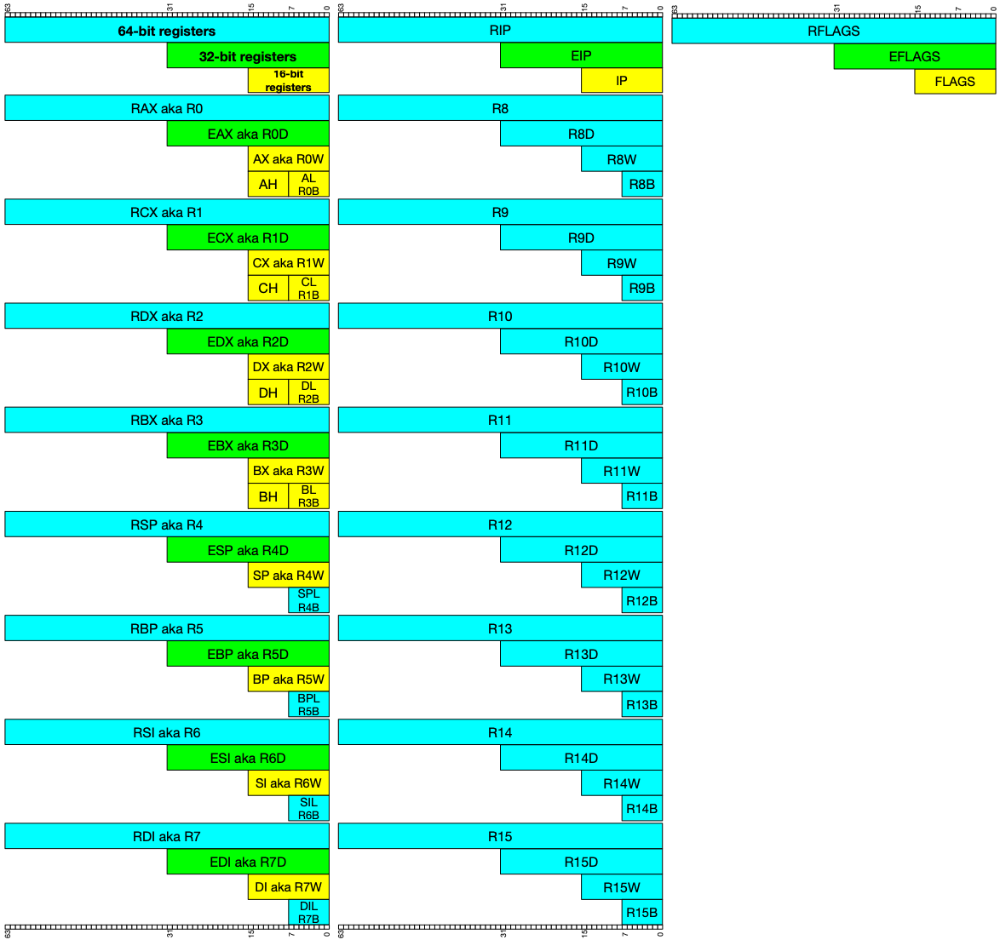

# Assembly Notes

Date: December 25, 2023
Class: Cyber
Type: Lecture
Materials: https://pwn.college/cse365-s2023/assembly-crash-course
Reviewed: No

# Intel vs. AT&T Syntax

### Order of Operands

Intel: Destination ← Source

- Generally used in Windows
- `mov rbp, rsp` ⇒ rbp := rsp
- `add rsp, 0x14` ⇒ rsp += 0x14

AT&T: Source → Destination

- Registers prefixed with `%`
- Immediates prefixed with `$`
- Generally nix/GNU
- `mov %rsp, %rbp` ⇒ rsp → rbp
- `add $0x14, %rsp` ⇒ rsp += 0x14

### Size of Operands

Intel: indicate size with things like “mov qword ptr**,** [*rax*], *rbx*”

- Not indicated in the actual mnemonic of the operations

AT&T: size of memory operands is determined from the last character of the instruction mnemonic (only when there’s no other way to disambiguate an instruction)

- movb: operates on bytes
- movw: operates on words
- movl: operates on dwords (longs)
- movq: operates on qwords
- Some mnemonics have also been renamed to account for this

### rm/X Forms

Intel: `[base + index*scale + disp]`

AT&T: `disp(base, index, scale)`

# Data

### Bits and Bytes

Stored in ******binary******, with `1` and `0` *bits*

- Different architectures have different numbers of bits in a byte
- In modern architectures, 8 bits makes up a ***byte***

*****Words*****: groupings of bytes

- Architectures define the ***********word width***********
- When we refer to x86 as a 64-bit architecture, we mean it has 8 bits to a byte, and 8 bytes to a word, for a word length of 64 bits
    - It deals with 64 bits at a time

Historically,

- byte = 1 byte, 8 bits
- word = 2 bytes, 16 bits
- dword = 4 bytes, 32 bits
- qword = 8 bytes, 64 bits

### Expressing Numbers

A 64-bit machine can reason about 64 bits at a time

- Note: in practice, modern x86 can use specialized hardware to crunch about 512 bits of data at a time

What do we do with integer overflow during addition?

- How do we add 1 + 0xffffffffffffffff = $1 + (2^{16}-1)$? = 1 + 0x10000000000000000
    - That extra 65th bit doesn’t fit, so we put it in a *********carry bit********* storage by the CPU
    - The result of the computation is `0`
    - If we want that carry bit, we need to get it immediately
    - The same process happens with integer underflow, e.g. subtracting `0-1`

### Two’s Complement

- Negative numbers are represented as the large positive numbers they would correlate to in an unsigned int
- Our binary is represented for an n-bit number as:

$$
(-a_{n-1}2^{n-1})+a_{n-2}2^{n-2}+2^{n-3}+\cdots+a_22^{2}+a_12^{1}+a_02^{0}
$$

- For example, for an 8-bit number:
    - Upper positive limit: `0b01111111` = $\sum_{i=0}^{6}2^i=2^7-1=127$
    - Lower negative limit: `0b100000000` = $-2^7=-127$

$$
-a_82^8+a_72^7+a_62^6+a_52^5+a_42^4+a_32^3+a_22^2+a_12^1+a_02^0
$$

- We don’t have to take sign into account when doing arithmetic with this system

### Anatomy of a Word

Consider the 32-bit word:

11000000 00000001 11000100 01110101

`0xc001c475`

- ***************************Most significant bits/bytes*************************** = leftmost = high
- ****************************Least significant bits/bytes**************************** = rightmost = low

# Registers

[Register Cheat Sheet](https://ost2images.s3.amazonaws.com/Arch101_x86-64_Asm/CheatSheet_x86-64_Registers.pdf)



Registers are stored in the CPU

- Data flows from system memory, into caches, and then into registers to be used by the process
- Data can also flow directly from instructions into registers

*********Registers*********: fast, temporary storage for data

- The typical place to store data for the CPU to actually interact with
- We have several general purpose registers
    - x86: `eax`, `ecx`, `edx`, `ebx`, `esp`, `ebp`, `esi`, `edi`
    - amd64: `rax`, `rcx`, `rdx`, `rbx`, `rsp`, `rsi`, `rdi`, `r8`, `r9`, `r10`, `r11`, `r12`, `r13`, `r14`, `r15`
        - amd64 is x86-64,the 64-bit version of the x86 instruction set
- There are some special purpose registers, such as the register that stores the next instruction in our instruction set

### Register Conventions

- `rax`: stores function return values
- `rbx`: base pointer to the data section
- `rcx`: counter for string and loop operations
- `rdx`: i/o pointer
- `rsi`: source index pointer for string operations
- `rdi`: destination index pointer for string operations
- `rsp`: stack (top) pointer
- `rbp`: stack frame base pointer
- `rip`: pointer to the next instruction to execute

### Register Size

- Registers are typically the size of the word width of the architecture
    - So in x86-64, most registers will hold 64 bits/8 bytes

### Partial Register Access

- Registers can be accessed *********partially*********
    - This reflects the register access from previous iterations of the architecture with different word widths
- All partial registers on amd64
    
    
    

### Setting Registers

Load data into registers with `mov` keyword

- We cannot do memory to memory movement, only one of the arguments can be an immediate
- x86 does not support memory to memory transfer
- Cannot move a 64 bit value into memory, only a 64 bit value into a register at most

Examples: loading a number into a register

- `mov rax, 0x539`
- `mov rbx, 1337`
- `mov al, 0x05`
`mov ah, 0x39`
    - Using partial registers, achieves same affect

Data specified directly in the instruction is called an *immediate value*

### 4-byte Caveat

- If you write to a 4-byte/32-bit partial registers (e.g. `eax`, `esi`, `r12d`), the CPU will zero out the rest of the register for performance reasons

```nasm
mov rax, 0xffffffffffffffff
mov ax, 0x539 
```

- Above code will set `rax` to `0xffffffffffff0539`, as expected

```nasm
mov rax, 0xffffffffffffffff
mov eax, 0x539 
```

- Above code will set `rax` to `0x0000000000000539`, clobbering the top bits of `rax` because we touched `ebx`

### Moving Data Around

- We can copy data from register to register

```nasm
mov rax, 0x539
mov rbx, rax
```

- Sets both registers to `0x539`

We can also move between partial registers as long as sizes line up

```nasm
mov rax, 0x539
mov rbx, 0
mov bl, al
```

- Sets `rax` to `0x539` and `rbx` to `0x39`

### Extending Data

Consider the following instruction

- `mov eax, -1`
- This would set `eax` to `0xffffffff` because of the two’s complement
    - Unsigned representation of $2^8-1$, signed two’s complement of $-1$
- Now, `rax` is `0x00000000ffffffff`, which can only represent
    - Both unsigned and signed representation of $2^8-1$

`movsx`: move + sign extend, preserves the two’s complement value

```nasm
mov eax, -1
movsx rax, eax
```

- Sets `rax` to the proper `0xffffffffffffffff`

### Register Arithmetic

- `add`: add second register to first
- `sub`: add second register to first
- `imul`: multiply and truncate to 64-bits, signed number
- `mul`: multiply unsigned numbers
- `inc`: increment register
- `dec`: decrement register
- `neg`: negate numerical value of register
- `not`: negate each bit of register
- `and`: bitwise and second register into first
- `or`: bitwise or second register into first
- `xor`: bitwise xor second register into first
- `shl`: shift bits left by specified amount
    - `shl rax, 10` adds 10 zeros on right
- `shr`: shift bits right by specified amount
    - `shr rax, 10` fills with 0 zeros on left
- `sar`: shift bits right, with sign-extension to fill “missing” bits
- `rol`: rotate bits to left by specified amount
- `ror`: rotate bits to right by specified amount
- `xchg`: swap values in two registers

### Special Registers

- `rip`: memory address of next instruction to be executed (ip = instruction pointer)
- `rsp`: contains address of stack, region in memory to store temporary data (sp = stack pointer)

# NOP

`nop`: no-operations

Exists to pad/align bytes, or delay tie

Attackers can use it to make simple exploits more reliable

# Memory (Stack)

When we have too much data, we can store it in memory, where we still have *fairly fast* access

- When requested, data goes from memory into caches, eventually passed into registers to be used by the CPU
    - This takes time, so we want to work on registers whenever possible and only go to memory when needed

### Virtual Memory: Side Note

Virtual memory is essentially indirection

- When a program generates a virtual address, the processor needs to access some physical address
- The processor maps what the program is trying to access to the real address in physical memory
- Implemented through page tables
- 3 main problems virtual memory addresses
    - We run out of RAM
    - We have holes in our address space
    - Programs try to write over each other

Ex (running out of RAM): MIPS is an architecture that gives each program a 32-bit address space where programs can access any byte, giving access for any address from `0x00000000` to `0xffffffff`

- Since $2^{32}$ bits, or about 4GB, are promised, every program can access this
- If we promise every program access to this but our actual machine does not, such as if our actual machine only has 1GB, we’ll run into problems

“Any problem in computer science can be solved by adding indirection”

How does virtual memory work?

- Without it, program address = RAM memory
    - So in our MIPS example, if we have a 32-bit program address space (4GB) and a 30-bit RAM address space (1GB), accessing anything beyond 1GB in the program address space would crash the RAM
- With virtual memory
    - When accessing any value in our program address space, we look in a ***map*** for a valid value in the RAM address space (note: the space in the RAM address space does not have to be linear)
        - Additionally, if we end up accessing more than our RAM address space allows in our program, our map can recognize this
            - It can then use a ********page out********, which moves the oldest data to the disk, freeing RAM
            - This mapping can use our disk to give our programs the illusion of unlimited memory, moving as much data to the disk as we need
            - However, we will have much slower performance as reading from the disk can be thousands of times slower than from RAM
        - This is also better for program security
            - The map ensures that each program has its own address space and they can’t access each other’s address spaces
            - This gives us program isolation as long as our maps don’t collide these program accesses, which can increase security
            - Caveat: we don’t always want data to be isolated
                - For example, a lot of data is shared between programs (e.g. fonts, graphics, icons, libraries, dialog boxes)
                - We can use the same mapping to allow programs to share data and make this more efficient
        - This is why buying more memory can make our computer run faster, as we don’t have to go to our disk as often to access data

How do programs access this?

- Basic idea: separate memory spaces
    - **************Virtual memory**************: what the program sees
        - e.g. `mov register, virtualmem` accesses virtual addresses specified
    - ************Physical memory************: the physical RAM in the computer
        - e.g. with 2GB of RAM installed, we will have physical addresses $0$ to $2^{31}-1$
1. Program executes a move specifying a virtual address (VA)
2. Computer translates the address to the physical address (PA) in memory
    1. If the PA is not in memory, the OS loads it from disk
3. The computer reads the RAM using the PA and returns the data in the program

### Memory from a Process Perspective

- Process memory transfers data between registers, the disk, networks, and video cards
- Since there is too much memory to name every location like we do registers, we *******address******* process memory linearly (amd64 allows us about 127 terabytes of addressable data in the process address space)
    - From: `0x1000`
    - To: `0x7fffffffffff`
- This space starts out partially filled with program binary data, dynamically allocated memory (heap), library code, process stack, OS helper regions, and dynamically mapped memory requested by the process throughout

### The Stack

A conceptual area in main memory (RAM) designated by the OS when the program is started

This stored LIFO data with fairly fast access

The stack can ****grow****, generally towards lower memory addresses

`rsp` points to the top of the stack

While data exists at addresses beyond the top of the stack (at lower addresses), these should be considered undefined

What can we find on the stack?

- Return addresses to a function, so that within a function we can return back to the function that called it
    - When each function is called, it has a *****frame***** on the stack for its function
- Local variables
- *********Sometimes********* used to pass arguments between functions
- Save space for registers so functions can share registers without smashing the value for each other, or where in there too much data to be handled in a single function
- Some macros, like `alloca()` explicitly allocate on the stack instead of the heap

We know where the stack is stored because the CPU keeps it starting address in `rsp`

- Note: the address typically starts with `0x7f...`

We can `push` data onto the stack, LIFO

- `push` pushes a QWORD onto the stack, so `rsp` is decremented by 8

```nasm
; Write to a register
mov rax, 0xc001ca75
; Push this register onto the stack
push rax
; Push immediates to a stack
; Warning: even on 64-bit x86, we can only push 32-bit immediates (will be 0-padded)
push 0xb0bacafe 
; Push register onto stack again
push rax
```


- We can `pop` from the stack, LIFO

```nasm
pop rbx ; Sets rbx to 0xc001ca75, most recently pushed value
pop rcx ; Sets rcx to 0xb0bacafe, next most recently pushed value
```


### `r/mx` Addressing Form

- Differences between `r/m8`, `r/m16`, `r/m32`, or `r/m64` in the Intel manual

This is a way to specify either a register or a memroy value in 8/16/32/64 bits long

- In intel syntax, `[]` specifies that the value within is a memory address, so we fetch the value at that address (like dereferencing a pointer)

An `r/mX` can take 4 forms:

1. Register: `rbx`
2. Memory, base-only: `[rbx]`
3. Memory, base+index*scale: `[rbx+rcx*X]`
    1. For X = 1, 2, 4, or 8 ****only****
4. Memory, base+index*scale+displacement: `[rbx+rcx*X+Y]`
    1. For Y of 1 byte (0-2^8) or 4 bytes (0-2^32)

This has natural applicability to multi-dimensional array indexing, arrays of structs, etc.

These forms are annotated with data sizes, such as:

- `qword ptr [rsp+10h]`
- `dword ptr [rsp]`
- `word ptr [rsp]`

### Accessing Memory using Addresses Directly

- We have to be careful and make sure something actually exists where we are trying to exist
    - Memory is virtual, so it may not exist!
- When accessing memory, we use brackets to specify that a value is a memory address

Ex: load the 64-bit value (word) stored at the memory address `0x12345` into `rbx`

```nasm
mov rax, 0x12345
mov rbx, [rax]
```

Ex: store the 64-bit value in `rbx` into the memory at address `0x133337`

```nasm
mov rax, 0x133337
mov [rax], rbx
```

Ex: the following is equivalent to `push rcx`

```nasm
sub rsp, 4       ; Move stack backward by 4 bytes, expanding
mov [rsp], rcx   ; Copy the value from rcx into the front of the stack
```

### Controlling Write Sizes

- We can use partial registers to store/load fewer bits

Load 64 bits from address `0x12345` and store the lower 32 bits to the address `0x133337`

- Recall: if we load into `eax` /`ebx`, we zero out the top 32 bits of that register

```nasm
; Load 8 bytes from the memory location to read from into rbx
mov rax, 0x12345
mov rbx, [rax]
; Write 4 of those bytes from ebx into the memory location we want to write to
; Note: ebx is a 4-byte 32-bit register
mov rax, 0x133337
mov [rax], ebx
```

### Memory Endianness

Memory is byte addressed, and the bytes can be ordered in two ways

In an n-byte system:

- *************Little-endian*************: byte 0 is the least significant byte, byte n-1 is the most significant
- **********Bit-endian**********: byte 0 is the most significant byte, byte n-1 is the least significant

Word addresses remain the same, only the bytes in the word change

Data on most modern systems is stored in little endian, so backwards

- Bytes are *only* shuffled for multi-byte stores and loads of registers to memory
- Individual bytes *****never***** have their bits shuffled
- Note: writes to the stack behave just like any other write to memory, so this shuffling also exists
- Historically, this was created to make arithmetic carry implementation easier

### RIP-Relative Addressing

RIP: the instruction pointer

`lea`: load effective address, one the few instructions that can directly address the `rip` register in x86

- Takes in data of mX form, but does not dereference it, despite the square brackets
- Frequently used with pointer arithmetic, but sometimes used for just arithmetic in general
- Ex: `rbx = 0x2`, `rdx = 0x1000`
    - `lea rax, [rdx+rbx*8+5]`
    - This sets `rax = 0x1015`
- When the C compiler see’s math that cam be computed in the form `a + b*X + Y`, it automatically compiles this to a `lea` instruction, rather than using `imul` and `add` for efficienciy

We can also use `mov` to read directly (or even technically write) from these locations in amd64

This is useful when we embed data around our code, such as in an ELF file

### Writing Immediate Values to Memory

When we write from a register to memory, the CPU knows the size of the register so it’s easier to write

For example, the below specifies that the value in `rax` is a double word (32-bit/4-byte) pointer and writes a 32-bit 0x1337 padded with 0 bits to the address at `rax`

```nasm
mov rax, 0x133337
mov DWORD PTR [rax], 0x1337
```

# Local Variables

Allocated in the stack

### Array Local Variables

We’ll start by studying the operations used in creating arrays 

`imul`: 13 forms we can treat in a few categories

- `imul r/mX`: single operand
    - There’s a variety of forms that take in rax/rdx or its partials and implicitly chooses them based on size
    - Note: no danger of truncation for these because we store the output in twice the size of the operands (8 bit into 16 bit)
    - `imul r/m8`
        - AX = AL * r/m8
    - `imul r/m16`
        - DX:AX = AX * r/m16
    - `imul r/m32`
        - EDX:EAX = EAX * r/m32
    - `imul r/m64`
        - RDX:RAX = RAX * r/m64
- `imul reg, r/mX`
    - reg = reg * r/mX
    - Note: this could lead to truncation, as we multiply 2 16-bit operands into a 16 bit output
- `imul reg, r/mX, immediate`
    - reg = r/mX * immediate
    - Note: this could lead to truncation, as we multiply 2 16-bit operands into a 16 bit output

`movzx`: move with zero extend

- Move small ctypes into larger ctypes (small values into larger registers)
- Support same r→r, r→m, m→r, i→m, i→r forms as normal `mov`
- CPU unconditionally fills higher order bits of larger registers with zeros

`movsx`: move with sign extend for 8 or 16 bit values

`movsxd`: move with sign extend for 32 bit values to 64 bit values

- CPU fills higher order bits of larger destination register with whatever value the sign bit is set to on the small value to maintain the same signed value

Note: local variables do not need to be stored in the stack in the same order they are defined in the high level language

- It generally depends on the order we allocate them

In Visual Studio, array access is typically done by multiplying the size of the array element (e.g. 4 bytes for an int) by the index that is desired to be accessed

- For example, the below sets `b[4] = b[1]+c`
- Note: accessing data with `b[]` and `c` get converted to r/mX forms

```nasm
; Access b[1]
mov eax, 4                    ; 4 byte int
imul rax, rax, 1              ; 1st index
movsxd rax, dword ptr b[rax]  ; Move the dword 4 bytes after the start of b

; Add c
add rax, qword ptr [c]

; Set to b[4]
mov ecx, r                    ; 4 byte int
imul rcx, rcx, 4              ; 4th index
mov dword ptr b[rcx], eax     ; Move result into dword 16 bytes after b
```

# Control Flow

How do computers actually executed code?

- Assembly instructions are just data, the instructions are direct translations of binary code that lives in memory as any other data would
- Note: x86 is a variable width instruction set architecture (as are most popular architectures)
    - Depending on the instruction, there is a different number of bytes that encode it
    - Arm does **not** have a variable width instruction set
- The CPU knows to execute it because the RIP points towards the instruction to execute

### Jumps

CPUs execute instructions in sequence until told not to, and one way to interrupt that sequence is with `jmp`, the ******************unconditional jump******************

- Unconditionally change RIP to a given address

Short, relative `jmp`: RIP = RIP of next instruction + 1 byte sign extended to 64 bit displacement

- Frequently used in small loops
- Also called a `jmp short`

Far, absolute indirect `jmp`: RIP changed to an explicitly address

Near, relative `jmp`: RIP = RIP of next instruction + 4 byte sign extended to 64 bit displacement

Near, absolute indirect `jmp`: RIP changed to r/mX jump

The following code moves 1337 into `cx`, then immediately pushes `rcx` (which contains this 1337) onto the stack

```nasm
	mov cx, 1337
	jmp STAY_LEFT
	mov cx, 0
STAY_LEFT:
	push rcx
```

- `jmp` can also jump to an absolute address, an offset from the current instruction, or a location in the register
- When compiled, the above code specifies in the binary code a number of bytes to jump by
    - This is a *signed jump*, so if this number of bytes is negative, it can jump backwards (basis for loops)

### Conditional Jumps

`jcc`: jump if a condition is met

`rflags`: holds many single bit flags 

Zero Flag (ZF): set to zero if the result of an instruction is zero

Sign Flag (SF): set equal to most significant bit of a result, which indicates sign for two’s complement integers

### Special Names for Conditional Jumps

`je` - jump if equal

`jne` - jump if not equal

`jg` - jump if greater

`jl` - jump if less

`jge` - jump if GEQ

`jle` - jump if LEQ

`ja` - jump if above (unsigned)

`jb` - jump if below (unsigned)

`jae` - jump if above or equal (unsigned)

`jbe` - jump if below or equal (unsigned)

`js` - jump if signed

`jns` - jump if not signed

`jo` - jump if overflow

`jno` - jump if not overflow

`jz` - jump if zero

`jnz` - jump if not zero

What are we actually checking?

### Conditions

Conditions are stored in the flags register: *rflags*

*rflags* holds bits representing each condition flag

- Bit 1 represents a certain flag, bit 2 represents another flag, etc.

Flags are updated by:

- Most arithmetic operations
- `cmp` - comparison operator, essentially `sub` but discarding result
- `test` - comparison operator, essentially `and` but discarding result

Main conditional flags

- Carry flag: was the 65th bit after the last arithmetic operation 1?
- Zero flag: was the result 0?
- Overflow flag: did the result wrap between positive to negative?
- Signed flag: was the result’s signed bit set (i.e. was the result negative)?

Common patterns in conditional flow:

```nasm
cmp rax, rbx; ja NEXT                checks if unsigned rax > rbx 
test rax, rax; jnz STAY_LEFT         checks if rax != 0
```

### Signed vs. Unsigned Inference

- There are different conditions for unsigned vs signed values (e.g. above for unsigned vs greater for signed)
- Which leads to different assembly instructions for unsigned (e.g. `ja`) vs signed (e.g. `jg`)
- Which implies the compiler emits different code whether the programmer declared unsigned or signed variables
- Which can be used in reverse engineering or by a decompiler

### Loops

Below is a basic for loop that counts to 10:

```nasm
mov rax, 0                 ; int i = 0
LOOP_HEADER:               ; for
	inc rax                  ; i++
	cmp rax, 10              ; i < 10
	jb LOOP_HEADER           ; continue
```

# Functions

### Function Calls

`call` pushes a value to `rip` and jumps to it

- First `push` the address of the next instruction in this function onto the stack (so we can return to it by use of `ret` when the procedure is done)
- Then change `rip` to the address given in the instruction

`ret` pops the next value from `rip` and jumps to it, BUT THERE ARE TWO FORMS

1. Pop the top of the stack into `rip`, incrementing `rsp`
2. Same function as before, but also add a constant number of bytes to `rsp` 
    1. Notation: `ret 0x8`, `ret 0x20`, etc.

```nasm
_start:
	mov rdi, 0
	call FUNC_CHECK_EQ_LEET
	mov rdi, 1
	call FUNC_CHECK_EQ_LEET
	call FUNC_EXIT
	
FUN CHECK_EQ_LEET:
	test rdi, rdi
	jnz LEET ; jump if rdi is 1
	ret
	LEET:
		mov ax, 1337
		ret
```

### Passing Parameters - Calling Convention

1 parameter

```c
int func (int a) {
	int i = a;
	return i;
}
int main() {
	return func(0x11);
}
```

- Compiles to the following
- Note: the callee reaches outside of its stack frame to grab the parameter from `main`, creating a copy of it
- Additionally, the return value of this is stored in `eax`

```nasm
main:
	sub rsp, 28h                  ; Allocate shadow space (Microsoft x64 ABI Shadow Space)
	mov ecx, 11h                  ; Move 0x11 parameter into ecx
	call func(0140001000h)        ; Call func, pushing the next address in main to rip and jumping to the location of func
	add rsp, 28h                  ; Shadow space
	ret                           

func:
	mov dword ptr [rsp+8], ecx    ; func reaches outside its stack frame to grab parameter, writing it back into the stack
	sub rsp, 18h                  ; Increase stack frame by 3 qwords
	mov eax, dword ptr [rsp+20h]  ; Reaching outside the stack frame to grab the parameter we set a few lines back
  ; Note: the previous few lines seem inefficient. We are taking the parameter from the register, and writing+grabbing from the stack instead of just taking from register
	mov dword ptr [rsp], eax      ; Allocate i, set equal to parameter (creating a copy, pass by value)
	mov eax, dword ptr [rsp]      ; Set eax to return value, the copy we just created (int i)
	add rsp, 18h                  ; Decrease and reset stack frame
	ret
```

What happens when we have too many parameters?

```c
int func (uint32 a, uint32 b, uint32 c, uint32 d, uint32 e) {
	int i = a+b-c+d-e;
	return i;
}

int main() {
	return func(0x11, 0x22, 0x33, 0x44, 0x55);
}
```

- Compiles to the following
- Note: none of the arithmetic operations in func() using the parameters before assigning as a copy to `i` actually access within the stack frame, they all reach outside
- When we have 5 or more parameters, we have “too many parameters”
    - The first 4 parameters can be allocated first to registers
        - This is the Microsoft ************shadow store************
        - The caller must always allocate sufficient space to store four register parameters, regardless of if the callee takes that many parameters
    - With more than 4, we see the 5th and above pushed onto the stack as opposed to passed in a register and fed back into memory
        - In order to follow the same pattern with the shadow store and these memory allocated parameters, we push the shadow store back onto the stack at the start of functions

```nasm
main:
	sub rsp, 38h                  ; Increase stack frame by 7 qwords + shadow space
	; 5th parameter is when we hit too many parameters
	mov qword ptr [rsp+28h], 55h  ; Set value 5 qwords above stack frame to 55h
	; Move remaining parameters into available registers
	mov r9d, 44h
	mov r8d, 33h
	mov edx, 22h
	mov ecx, 11h
	call 0000000140001000         ; Call func()
	add rsp, 38h                  ; Decrease and reset stack frame
  ret

func:
	mov dword ptr [rsp+20h], r9d  ; Overwriting the 55h from before?
	mov dword ptr [rsp+18h], r8d  ; Again reaching outside stack frame to set parameter
	mov dword ptr [rsp+10h], edx  
	mov dword ptr [rsp+8], ecx    
	sub rsp, 18h                  ; Increase stack frame by 3 qwords
	; The following moves a and b into the same registers they were in in main
  mov eax, dword ptr [rsp+28h]  ; Grab b from stack
	mov ecx, dword ptr [rsp+20h]  ; Grab a from stack
	; Add a+b
	add ecx, eax
  mov eax, ecx
	; Complete rest of arithmetic operations by grabbing values directly from memory
	; The following operations all reach outside the stack frame again
	sub eax, dword ptr [rsp+30h]  ; Subtract c
	add eax, dword ptr [rsp+38h]  ; Add d
	sub eax, dword ptr [rsp+40h]  ; Subtract e
	; Copy result into i, reflecting pass by value
	mov dword ptr [rsp], eax
	; Set eax to return value
	mov eax, dword ptr [rsp]
	; Reset stack frame, return
	add rsp, 18h
	ret
```

### Calling Conventions (General)

Note that with this flow, callee and caller functions must agree on passing arguments through the same registers and the return value through the same register

This is because registers are shared between functions

In Linux amd64, the convention is:

- Arguments: rdi, rsi, rdx, rcx, r8, r9
- Return value: rax

This is because rbx, rbp, r12, r13, r14, r15 are “callee-saved”

- The function promises to keep these values safe generally
- If we want to make changes to them we gotta first save tem (on the stack usually) and pop them before usage

### 64-bit Calling Conventions

- This section and the following are all in the Microsoft x86 ABI and System V x86-86 ABI calling conventions (used by Visual Studio C++ and UNIX respectively)

Caller-save registers (volatile registers)

- The caller should assume they ****will**** be changed by the callee
- Registers belong to the callee
- The caller is in charge of saving the value before calling a subroutine and restoring the values after returning
- Visual Studio: `rax`, `rcx`, `rdx`, `r8`, `r9`, `r10`, `r11`
- GCC: also includes `rdi`, `rsi`

Callee-save registers

- Non-volatile registers
- The caller can assume these registers ********will not******** be changed by the callee
- Registers belong to the caller
- If the callee needs these, the callee is responsible for making sure those values are restored
- Visual Studio: also `rdi`, `rsi`
- GCC: `rbx`, `rbp`, `r12-r15`

### Balance

Both caller and callee registers must balance register saves with register restores

- Callers save registers right before the call and restore right after
- Callees save registers at the start of the function and restore at the end
- No other operations happen before or after these as part of the function calling process

### Parameter Passing Conventions

- Parameters are passed through a subset of caller-save registers
    - Visual Studio
        - First 4 parameters are put into:
            - `rcx`, `rdx`, `r8`, `r9` respectively
            - For the shadow space
        - The rest are pushed onto the stack
    - System V (GCC)
        - First 6 parameters are put into:
            - `rdi`, `rsi`, `rcxf` `rdx`, `r8`, `r9` respectively
            - For the shadow space
        - The rest are “pushed” onto the stack so that the left-most parameter is at the lowest address
            - But, use `mov` instead of `push`
- Return value is sent through `rax` for anything 64 bits or smaller
    - Can also use `rdx:rax` to return 128 bit values

### 32-bit Calling Conventions

Linkage

We use `ebp` to to point to the base of a stack frame, allowing for us to change our stack size automatically

- Every time we call a new function, we push and save the previous `ebp` to be restored when the function ends
- This allows us to always revert our `ebp` and use it to reset our `esp` when a function ends

# System Calls

Jumps to the operating system and gives it an instruction

- The OS mediates the interaction between your program and the environment

`syscall` triggers the system call specified by the value in `rax` that we can find in a lookup table

The arguments to the lookup call are in rdi, rsi, rdx, r10, r8, and r9

The return value from the `syscall` is stored in `rax`

[Chapman system call table](http://blog.rchapman.org/posts/Linux_System_Call_Table_for_x86_64/)

Ex: reading 100 bytes from stdin to the stack

```nasm
mov rdi, 0 ; stdin file descriptor
mov rsi, rsp ; rsi is where we read data to, so we set it to the stack
mov rdx, 100 ; the number of bytes to read
mov rax, 0 ; system call number of read()
syscall
```

Ex: writing out bytes

- `read` returns the number of bytes read through `rax`, so we can easily write them out

```nasm
mov rdi, 1 ; the stdout file descriptor
mov rsi, rsp ; write the data from the stack
mov rdx, rax ; the number of bytes to write (which is the same as what we read)
mov rax, 1 ; system call number of write()
syscall
```

There are over 300 syscalls in Linux, and they have well-defined interfaces we can look up

### String Arguments

Some syscalls take string arguments, such as file paths

These strings are a continuous string of bytes in memory (such as in ASCII) followed by a zero byte, as C strings

We can build these strings on the stack

For example, we could move this string onto the stack byte by byte and called the file open() function

```nasm
mov BYTE PTR [rsp], '/' ; write ASCII value of / onto the stack
mov BYTE ptr [rsp+1], 'f'
mov BYTE ptr [rsp+2], 'l'
mov BYTE ptr [rsp+3], 'a'
mov BYTE ptr [rsp+4], 'g'
mov BYTE ptr [rsp+5], 0

; Now, open() the /flag file
mov rdi, rsp ; indiciate that we want to read data onto the stack
mov rsi, 0 ; open the file in read only mode
mov rax, 2 ; syscall number of open()
syscall
```

### Quitting Program

```nasm
mov rdi, 42 ; return code from program
mov rax, 60 ; syscall number of exit()
syscall
```

# Building and Debugging Assembly Programs

### Assembling

We start by indicating what syntax we want, usually Intel

Additionally, we indicate whether or not we want to prefix our register names with a `%`

Additionally, we use `.global _start` to indicate that there’s a variable defining where to start

```nasm
.global _start
.intel_syntax noprefix

_start:
	mov rdi, 42
	mov rax, 60
	syscall
```

We write this in an asm source file, with the file extension `.S` 

To assemble, use `gcc -nostdlib` 

- This build your assembly into a full ELF program

We can check the return code from the program with `echo $?`

### Disassembling

We can also disassemble our program from the binary using `objdump -M intel -d binary`, which returns the code we previously wrote:

```nasm
quitter:     file format elf64-x86-64

Disassembly of section .text:

0000000000001000 <_start>:
    1000:       48 c7 c7 2a 00 00 00    mov    rdi,0x2a
    1007:       48 c7 c0 3c 00 00 00    mov    rax,0x3c
    100e:       0f 05                   syscall
```

Since our binary will be a full ELF program, we can extract just our binary code using `objcopy --dump-section .text=binary_output_file quitter` and hexdump it with `hd binary_output_file`

### Submitting in the dojo

Assemble to object file:

- `as -o asm.o asm.S`

Copy .text section (code) to the file asm.bin:

- `objcopy -0 binary —only-section=.text asm.o asm.bin`

Send that to challenge

- `cat ./asm.bin | /challenge/run`

As one command:

- `as -o asm.o asm.S && objcopy -O binary --only-section=.text ./asm.o ./asm.bin && cat ./asm.bin | /challenge/run`

### Debugging

We can use a debugger like gdb

Breakpoints are triggered by `int3`

- If we have a debugger attached, this will stop the program and allow us to inspect the state
- Otherwise, the process will die

`strace` runs the program and will print out every `syscall` the program makes with arguments and return values

`rappel` lets you explore the effects of different instructions

# Attacking

### General Registers

`rax` and partials (accumulator): place return value of a function

`rbx` and partials (base): used as base pointer for memory access, to which an offset is usually added

`rcx` and partials (counter): used as a loop counter

`rdx` and partials (data): used to store temporary data in operations

### Index and Pointer Registers

`rsp` and partials (stack pointer): indicates top (first memory address) of stack

`rip` and partials (instruction pointer): indicates address to current instruction program is executing

`rbp` and partials (base pointer): beginning of the stack frame of a function

`rdi` and partials (destination index): generally used for copying strings of memory

`rsi` and partials (source index); generally used for copying strings of memory

# Example Workflow

We are given a C source program

```c
#include <stdio.h>

int main() {
    int i;
    printf("Enter a value :");
    scanf("%d", &i);

    if (i > 5) printf("Greater than 5");
    else printf("Less than or equal to 5");
    
    return 0;
}
```

Compile this as usual

- `gcc example.c -o example`

We can obtain the assembly of a complied program without the original source code 

- `objdump --disassemble example`
- Send it to a text file
    - `objdump -M intel --disassemble example > dump.txt`

We can dump the assembly of a specific function, like the main method, using GDB

- `gdb -batch -ex 'file example ' -ex 'disassemble main'`
- Note: there is a space at the end of ‘file example_’

We can also get this disassembly of `main` with the following 

- Run program on gdb
    - `gdb example`
- Set a breakpoint on main
    - `b main`
- Run the program
    - `r`
- The program execution will stop at main. Now, run
    - `set disassembly-flavor intel`
    - `disas`

### Tracing

`push rbp`

- `rbp` is the part of the stack in which local variables begin to be stored
- So we push this onto the stack when we start a new function to be able to recover it later

`mov rbp, rsp`

- Set the base pointer equal to the start of the stack
- Such an assignment is done so that at the beginning of the function, the base pointer points to the beginning of the stack frame (and the stack frame grows from here)

`sub rsp, 0x10`

- We then expand the stack by 16 bytes, allocating 16 bytes of space for the program to use

`mov rax, QWORD PTR fs:0x28`

- Assign FS:0x28 to the register `rax`
- FS:0x28 is the ************stack canary************, a random value used to mitigate the risk of buffer overflow. If this value is overwritten, the program will detect an attack/error and terminate

`mov QWORD PTR [rbp-0x8], rax`

- Set the first part of the stack frame (8 bytes) to rax, which is currently the stack canary

`xor eax, eax`

- Set eax to 0

`lea rax, [rip+0xe59]              # 0x55d267d19004`

- Load `rax` with the address to a string containing the message “Enter a value :"
- Note: if we use `print (char*) 0x55d267d19004` in GDB, we get our prompt string

`mov rdi, rax`

- Move the prompt string to `rdi`

`mov eax, 0x0`

- Set `eax` to 0 again

`call 0x55d267d18080 <printf@plt>`

- Call `printf`

`lea rax, [rbp-0xc]`

- Recall `[rbp-0xc]` is the address of a local variable, since `rbp` is the base pointer and we are just moving back 12 bytes from this
- Now, `rax` has a pointer to the variable `int i`

`mov rsi, rax`

- Assign `rax` to `rsi`, which is where information read from stdin through scanf goes to
- `rsi` now has a pointer to the variable `int i`

`mov eax, 0x0`

- Zero out `eax` again

`call 0x55d267d18090 <__isoc99_scanf@plt>`

- Call `scanf`, with the arguments we already set

`mov eax,DWORD PTR [rbp-0xc]`

- Assigns content at location of `i` to `eax`, setting it to the user input

`cmp eax, 0x5`

- Compare `eax` to 5

`jle 0x55d267d181f1 <main+104>`

- If the value in `eax` was less than `5`, jump to an address further down. At this address, we have
    
    `lea rax, [rip+0xe2e]`
    
    - Load `rax` with address to the string “Greater than 5”
    
    `mov eax, 0x0`
    
    - Zero out `eax`
    
    `call 0x5555555545e0 <printf@plt>`
    
    - Print out result

Similar logic is carried in between the `jle` and the jump location to print the result for the `else`

`mov eax, 0x0`

- Zero out `eax`

`mov rdx, QWORD PTR [rbp-0x8]`

- Load `rdx` with the value of the stack canary

`sub rdx,QWORD PTR fs:0x28`

- Subtract `rdx` from the known value of the stack canary to check if it has been changed

`je 0x55d267d1821e <main+149>`

- If the result of the subtraction results in 0, which would set the flags as if a comparison was equal, we jump forward to a leave statement
- Otherwise, the following is called
    
    `call 0x55d267d18070 <__stack_chk_fail@plt>`
    
    - Syscall for a program violation

Assuming the `je` is successful, we are taken to:

`leave`

- Restores the old value of the base pointer on the stack
- This basically discards of values on the stack we don’t need access to anymore

`ret`

- Pop the return address from the stack and redirect program execution to that address

# OpenSecurityTraining2 Assembly

- Includes bomb lab and basic buffer overflow lab
- [https://p.ost2.fyi/courses/course-v1:OpenSecurityTraining2+Arch1001_x86-64_Asm+2021_v1/course/](https://p.ost2.fyi/courses/course-v1:OpenSecurityTraining2+Arch1001_x86-64_Asm+2021_v1/course/)

# Endianness

### Litle Endian

- LSB of a word is stored at the lowest address
    - Intel is Little Endian
- In RAM, bytes in words will look backwards

Endianness applied to memory, not registers

- Registers are always in big endian

Endianness applied to bytes, not bits

Memory dump windows are typically in shown with the upper left being the lowest address

# CISC

A complex instruction set allows for repeatable instructions

`STOS` (store string): one of the instructions that can have a `rep` prefix

- All operations with the `rep` prefix do an operations `*cx` number of times, using it as a counter essentially
- Once `*cx == 0`, it continues to the next instruction
- Either stores 1, 2, 4, or 8 bytes at a time
- Either fill 1 byte at `[di]` with `al` or fill 1/2/4/8 bytes at `[*di]` with `al/*ax`
    - For our purposes, it stores /2/4/8 bytes at `[rdi]` with `al/*ax`
- Don’t forget to make sure `[rdi]` is properly callee or caller saved

`rep stos` is essentially a `memset()`

- Can be found when initializing an array
    - For example, `int arr[64] = {0}`

`rep movs`: essentially a `memcpy()` to itself

- Repeat move data string to string
- `movs` moves data from one memory location to the next
    - Unlike `mov`, memory to memory movement is allowed
        - Only between `[*si]` and `[*di]`
- Uses `*cx` registers as a counter

# Linux, GDB, and Debugging

Compile from C with `gcc`, using `-fno-stack-protector` flag

Create a GDB config file at `/home/user/gdbCfg` with the following

```nasm
display/10i $rip
display/x $rbp
display/x $rsp
display/x $rax
display/x $rbx
display/x $rcx
display/x $rdx
display/x $rdi
display/x $rsi
display/x $r8
display/x $r9
display/x $r12
display/x $r13
display/x $r14
display/10gx $rsp
start
```

Debug in GDB using this config file using `gdb a.out -q -x ~/gdbCfg`

- Use `ni` to go to next assembly instruction
- Use `si` to step into a function

### The Manual

Columns of the Intel manual for each instruction

- Opcode: the literal bytes emitted by a compiler for a certain instruction
- Instruction: a human-readable mnemonic used to represent an instruction, often including r/mX form immediates
- Operand/Encoding: a textual indication of what forms the operands can take
- 64-bit: whether or not an opcode is even possible to be encoded in 64-bit mode
- Description: a longer form of the instruction

Notes

- Any r/mX form can be either a register or a memory value
- immX is an immediate of X bytes
- rX is just a register

### Inline Assembly

Inline assembly: can place assembly directly in-place in a C/C++ file

- GCC allows inline assembly in GNU Assembler (gas) syntax
- Visual Studio/clang discontinued inline assembly support for 64-bit binaries
- gas syntax = AT&T syntax

`asm("instruction separated by \n")`

```nasm
asm("nop")
asm("movw $1234, %eax");

asm("movl -0x4(%rbp), %eax\n"
		"cmp ...\n"
		"and %ecx, %eax");
```

Extended asm (e.g. how to use C variables)

We use % in front of operands to interpolate C variables, but now use %% for regular AT&T syntax purposes

`asm(assembly template : output operands : input operands : list of clobbered registers);`

```nasm
asm("%0, %%eax" : : "r" (myVar));
```

### Standalone Assembly

Standalone assembly: pure assembly can be written in a standalone file, assembled by an assembler into an object file, and linked into the final binary with other complied objects

- Required in Visual Studio
- Some assemblers also have syntax variants and helper mechanisms to make programming in assembly easier
    - MASM (Microsoft Assembler) in Visual Studio
    - NASM (Netwide Assembler) for cross-platform

### Writing Raw Bytes

Instead of writing a human-readable form in assembly, you can write straight raw bytes that the processor will interpret as instructions

With GCC inline assembly, we use the .byte keyword

`asm(".byte 0x55");` is `push %rbp`

- Separate bytes with semicolon
